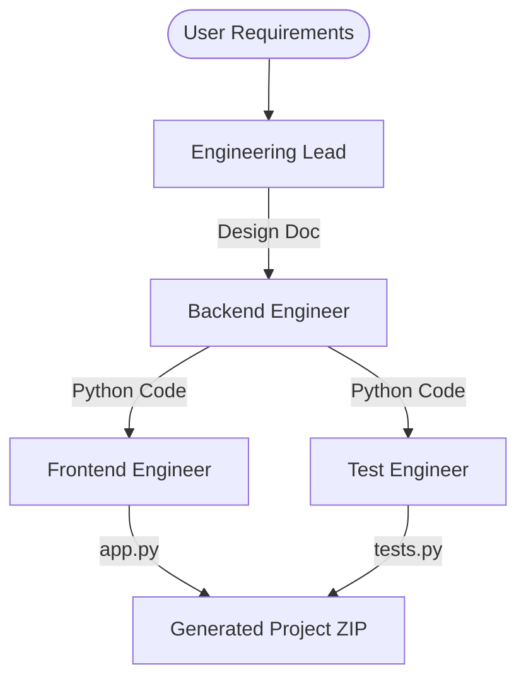

# ⚡ AI Engineering Team

**Autonomous Software Engineering Crew for High-Velocity Development**

The AI Engineering Team is a production-grade multi-agent orchestration system built with [crewAI](https://crewai.com). It automates the entire software lifecycle—from high-level requirements to architecture design, backend implementation, frontend prototyping, and unit testing.

[](https://huggingface.co/spaces/samrude1/EngineeringTeam)

---

## 🚀 Key Value Proposition

> "A full-stack engineering team that delivers tested, documented, and demo-ready Python applications in under 10 minutes."

- **Narrative**: Zero-to-one software development automation.
- **Tech Stack**: CrewAI, Claude 3.7 Sonnet (Backend/Tests), GPT-4o (Lead/Architecture).
- **Output**: Complete Python backend, Gradio UI, and Pytest suite.

---

## 🛠️ The Crew

The team consists of four specialized AI agents collaborating in a sequential orchestration process:

| Agent                 | Role      | Model               | Description                                                         |
| --------------------- | --------- | ------------------- | ------------------------------------------------------------------- |
| **Engineering Lead**  | Architect | `gpt-4o`            | Analyzes requirements and prepares a detailed architecture design.  |
| **Backend Engineer**  | Developer | `claude-3-7-sonnet` | Implements the core logic following the lead's design.              |
| **Frontend Engineer** | UI Expert | `claude-3-7-sonnet` | Builds a Gradio interface to demonstrate the backend functionality. |
| **Test Engineer**     | QA        | `claude-3-7-sonnet` | Writes comprehensive unit tests to ensure reliability.              |

---

## 🏗️ Architecture



---

## 💻 Local Setup

1. **Prerequisites**: Python 3.10+, [UV](https://docs.astral.sh/uv/) package manager.
2. **Install Dependencies**:
   ```bash
   uv pip install -e .
   ```
3. **Environment Variables**:
   Create a `.env` file:
   ```env
   OPENROUTER_API_KEY=sk-or-v1-...
   ```
4. **Run Web UI**:
   ```bash
   python app.py
   ```

---

## 🌐 Deployment (CI/CD)

This repository is configured with GitHub Actions to automatically sync to **Hugging Face Spaces**. 

1. **GitHub Secret**: Add `HF_TOKEN` to your repository secrets.
2. **Hugging Face Setup**: Add `OPENROUTER_API_KEY` to the Space's Secrets.

---

## 📄 License
This project is part of a professional portfolio showcasing agentic AI engineering.
