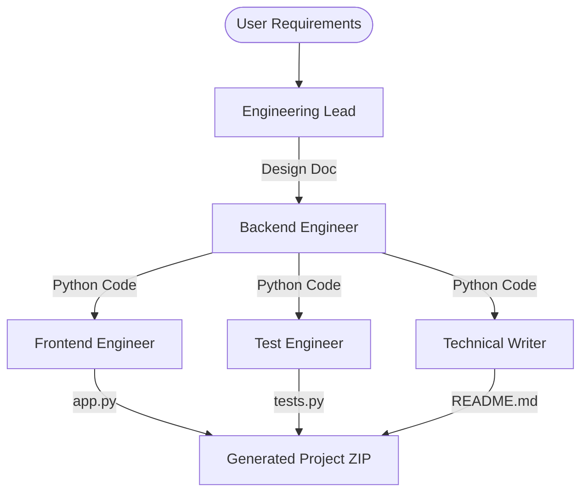

# ⚡ AI Engineering Team

**Autonomous Software Engineering Crew for High-Velocity Development**

The AI Engineering Team is a production-grade multi-agent orchestration system built with [crewAI](https://crewai.com). It automates the entire software lifecycle—from high-level requirements to architecture design, backend implementation, frontend prototyping, and unit testing.

[](https://huggingface.co/spaces/samrude1/EngineeringTeam)

---

## 🚀 Key Value Proposition

> "A full-stack engineering team that delivers tested, documented, and demo-ready Python applications in under 10 minutes."

- **Narrative**: Zero-to-one software development automation.
- **Tech Stack**: CrewAI, GPT-4o (Full Team), Gradio 5.
- **Output**: Complete Python backend, Gradio UI, and Pytest suite.

---

To get the most out of the **Version 2.0** Engineering Team, provide detailed, multi-step requirements. 

### 🚀 Professional Case: Personal Expense Tracker
> "Create a robust Personal Expense Tracking system to manage a monthly budget.
> - The system should allow users to add income and record expenses with a specific category (e.g., Housing, Food, Fun).
> - The system should calculate the current balance and show a summary of spending by category.
> - The system should track a 'Monthly Budget Limit' and return a warning if an expense exceeds the remaining budget.
> - The system should be able to report all transactions in a chronological list and calculate the total savings rate (%) at any point.
> - **Business Rules**: Prevent the user from recording an expense if the balance is zero (unless credit is allowed). Ensure all transactions have a timestamp.
> - **Logic**: Include a method to suggest a 'Savings Goal' based on current spending patterns (e.g., if total fun spending > 30%, suggest a 5% reduction)."

---

## 🛠️ The Crew

The team consists of four specialized AI agents collaborating in a sequential orchestration process:

| Agent                 | Role          | Model               | Description                                                          |
| --------------------- | ------------- | ------------------- | -------------------------------------------------------------------- |
| **Engineering Lead**  | Architect     | `gpt-4o`            | Analyzes requirements and prepares a detailed architecture design.   |
| **Backend Engineer**  | Developer     | `claude-3-7-sonnet` | Implements the core logic following the lead's design.               |
| **Frontend Engineer** | UI Expert     | `claude-3-7-sonnet` | Builds a Gradio interface to demonstrate the backend functionality.  |
| **Test Engineer**     | QA            | `claude-3-7-sonnet` | Writes comprehensive unit tests to ensure reliability.               |
| **Technical Writer**  | Documentation | `gemini-2.0-flash`  | Generates a professional README.md and user guide for the built app. |

---

## 🏗️ Architecture



---

## 🔒 Usage Limits & Security

To ensure a high-quality experience for all visitors and protect the project budget, the following limits are in place:

- **Rate Limiting**: 15 full generation runs per IP address.
- **Input Limit**: Requirements description is limited to 2000 characters.
- **Concurrency**: The system handles one generation at a time via a queuing system.

---

## 💻 Local Setup

1. **Prerequisites**: Python 3.10+, [UV](https://docs.astral.sh/uv/) package manager.
2. **Install Dependencies**:
   ```bash
   uv pip install -e .
   ```
3. **Environment Variables**:
   Create a `.env` file:
   ```env
   OPENROUTER_API_KEY=sk-or-v1-...
   ```
4. **Run Web UI**:
   ```bash
   python app.py
   ```

---

## 🌐 Deployment (CI/CD)

This repository is configured with GitHub Actions to automatically sync to **Hugging Face Spaces**. 

1. **GitHub Secret**: Add `HF_TOKEN` to your repository secrets.
2. **Hugging Face Setup**: Add `OPENROUTER_API_KEY` to the Space's Secrets.

---

## 📄 License
This project is part of a professional portfolio showcasing agentic AI engineering.
