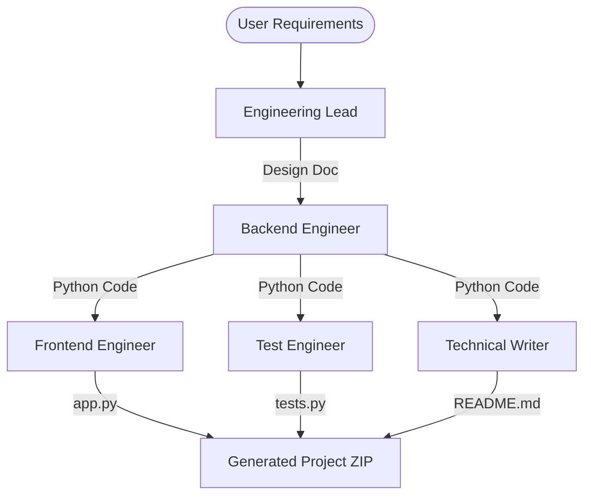

# ⚡ AI Engineering Team

**Autonomous Software Engineering Crew for High-Velocity Development**

The AI Engineering Team is a production-grade multi-agent orchestration system built with [crewAI](https://crewai.com). It automates the entire software lifecycle—from high-level requirements to architecture design, backend implementation, frontend prototyping, and unit testing.

[](https://huggingface.co/spaces/samrude1/EngineeringTeam)

---

## 🚀 Key Value Proposition

> "A full-stack engineering team that delivers tested, documented, and demo-ready Python applications in under 10 minutes."

- **Narrative**: Zero-to-one software development automation.
- **Tech Stack**: CrewAI, Python 3.10+, Anthropic Claude 4.5 & OpenAI GPT-4o, Gradio 5+.
- **Output**: Complete Python backend module, interactive Gradio UI prototype, and unit test suite.

---

## 📂 Project Structure

```
engineering_team/
├── app.py                      # Main Gradio 5 web interface & streaming logs
├── sample_showcase/            # Pre-generated zero-wait sample project showcase
│   ├── accounts_design.md      # Sample architectural blueprint
│   ├── accounts.py             # Sample backend logic & ledger
│   ├── app.py                  # Sample Gradio UI demo
│   ├── test_accounts.py        # Sample unit tests
│   └── README.md               # Sample documentation
├── src/
│   └── engineering_team/
│       ├── __init__.py
│       ├── crew.py             # CrewAI multi-agent definition & orchestration
│       ├── main.py             # CLI entrypoint for local execution
│       ├── utils.py            # SuperSanitizer, session cleaner, & ZIP packager
│       ├── config/
│       │   ├── agents.yaml     # Agent roles, goals, and backstories
│       │   └── tasks.yaml      # Sequential task definitions & contracts
│       └── tools/              # Extensible custom tools for crew agents
├── .agents/                    # Architecture, context, workflows, & agent rules
├── output/                     # Ephemeral workspace directories for runs
├── pyproject.toml              # UV / Hatchling project metadata & dependencies
├── requirements.txt            # Python dependencies
└── README.md                   # Project documentation
```

---

## 💡 Tech Stack

| Layer | Technology | Description |
| :--- | :--- | :--- |
| **Agent Orchestration** | [CrewAI](https://crewai.com) | Sequential multi-agent pipeline management with typed Pydantic outputs |
| **AI Models (Dream Team)** | Anthropic Claude 4.5 & OpenAI GPT-4o | Specialized LLMs for software architecture, coding, UI, and QA |
| **Web Interface** | [Gradio 5+](https://gradio.app) | Enterprise UI with streaming agent logs, CodeMirror editors, and custom CSS |
| **Package Management** | [UV](https://docs.astral.sh/uv/) / Hatchling | High-speed dependency resolution and packaging |
| **Testing Framework** | Python `unittest` | Automated unit test generation with mocking and edge-case verification |

---

## 🛠️ The Crew

The team consists of specialized AI agents collaborating in a sequential orchestration process:

| Agent                 | Role          | Model               | Description                                                          |
| --------------------- | ------------- | ------------------- | -------------------------------------------------------------------- |
| **Engineering Lead**  | Architect     | `claude-opus-4.5` (or `LEAD_MODEL`)     | Analyzes requirements and prepares architecture design.   |
| **Backend Engineer**  | Developer     | `claude-sonnet-4.5` (or `ENGINEER_MODEL`) | Implements core logic following the lead's design.        |
| **Frontend Engineer** | UI Expert     | `claude-sonnet-4.5` (or `ENGINEER_MODEL`) | Builds a Gradio interface to demo the backend.            |
| **Test Engineer**     | QA            | `claude-sonnet-4.5` (or `ENGINEER_MODEL`) | Writes comprehensive unit tests to ensure reliability.    |
| **Technical Writer**  | Documentation | `gpt-4o` (or `WRITER_MODEL`)   | Generates professional README and project metadata.       |

---

## 🏗️ Architecture


```mermaid
graph TD
    User([User Requirements]) --> Lead[Engineering Lead]
    Lead -->|Design Doc| Backend[Backend Engineer]
    Backend -->|Python Code| Frontend[Frontend Engineer]
    Backend -->|Python Code| QA[Test Engineer]
    Backend -->|Python Code| Doc[Technical Writer]
    Frontend -->|app.py| Output[Generated Project ZIP]
    QA -->|tests.py| Output
    Doc -->|README.md| Output
```

---

## 🔒 Security & Usage Limits

This project follows **DevSecOps best practices** to ensure a hardened environment for automated code generation:

- **Authentication & Access Control**: Optional HTTP Basic Auth via `GRADIO_AUTH_USER` and `GRADIO_AUTH_PASSWORD` for protected deployments.
- **Path & Input Sanitization**: All user-provided module and class names are sanitized using strict regex and `os.path.basename` to prevent directory traversal attacks.
- **Prompt Injection Defense**: User requirement specifications are strictly isolated inside `<user_requirements>` boundary tags with system constraints.
- **Input Character Guardrails**: Maximum 3,500 characters per requirement prompt to prevent context exhaustion and token burning.
- **Agent Sandbox Policy**: All agents have `allow_code_execution=False` enforced by default. The system produces code but never executes arbitrary code on the host environment.
- **Sliding Window Rate Limiting**: 15 requests per 1-hour window per IP address with automatic TTL timestamp pruning.
- **Daily Global Circuit Breaker**: Configurable daily global quota ceiling (`MAX_GLOBAL_DAILY_RUNS`, default 100) to protect OpenRouter API credits.
- **Instant Showcase Mode**: 1-click instant preview of pre-generated full-stack projects without API delays or token consumption.
- **Concurrency Control**: A FIFO queuing system ensures stable performance and prevents server exhaustion.
- **Environment Isolation**: No sensitive credentials or API tokens are ever exposed to the frontend or stored within generated project artifacts.


---

## 💻 Local Setup

1. **Prerequisites**: Python 3.10+, [UV](https://docs.astral.sh/uv/) package manager.
2. **Install Dependencies**:
   ```bash
   uv pip install -e .
   ```
3. **Environment Variables**:
   Create a `.env` file:
   ```env
   OPENROUTER_API_KEY=sk-or-v1-...
   # AI Dream Team Configuration
   LEAD_MODEL=openrouter/anthropic/claude-opus-4.5
   ENGINEER_MODEL=openrouter/anthropic/claude-sonnet-4.5
   WRITER_MODEL=openrouter/openai/gpt-4o

   # Optional: Web UI Authentication & Networking
   GRADIO_AUTH_USER=admin
   GRADIO_AUTH_PASSWORD=your_secure_password
   GRADIO_SERVER_NAME=127.0.0.1
   GRADIO_SERVER_PORT=7860
   ```
4. **Run Web UI**:
   ```bash
   python app.py
   ```

---

## 🌐 Deployment (CI/CD)

This repository is configured with GitHub Actions to automatically sync to **Hugging Face Spaces**. 

1. **GitHub Secret**: Add `HF_TOKEN` to your repository secrets.
2. **Hugging Face Setup**: Add `OPENROUTER_API_KEY` to the Space's Secrets.

---

## 📄 License
This project is part of a professional portfolio showcasing agentic AI engineering.
